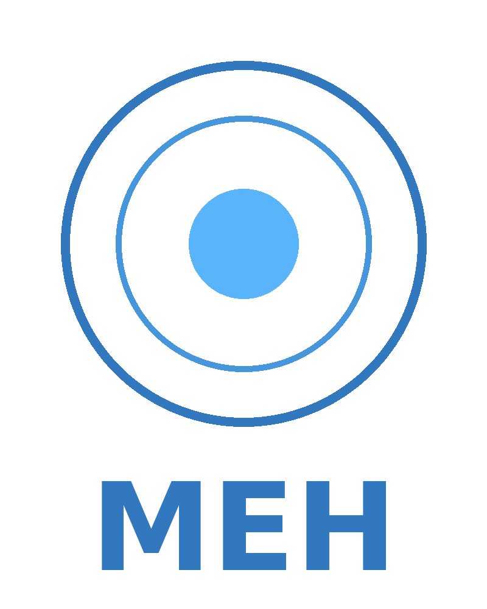

# MEH - Machine Eye Heuristics

<div align="center">
  
</div>

<div align="center">

[](https://opensource.org/licenses/MIT)
[](https://www.python.org/downloads/)
[](https://github.com/psf/black)
[](https://pycqa.github.io/isort/)
[](http://mypy-lang.org/)

</div>

## Overview

MEH (Machine Eye Heuristics) is a sophisticated video quality assessment tool that uses perceptual metrics to compare and evaluate video quality. It simulates viewing conditions of a 65" 4K/UHD OLED TV to provide accurate, real-world quality comparisons.

## Features

- Perceptual video quality assessment
- Dual-pane text-based GUI for easy file navigation
- Support for all ffmpeg-compatible video formats
- Quality difference scoring (0-100 scale)
- Multiple export formats (Markdown, JSON, YAML, XML)

## Installation

```bash
# Create and activate virtual environment
python -m venv venv
source venv/bin/activate  # On Windows: venv\Scripts\activate

# Install dependencies
pip install -r requirements.txt
```

## Development Setup

For development, install additional dependencies:

```bash
pip install -r requirements-dev.txt
pre-commit install
```

## Usage

[Coming Soon]

## Contributing

1. Fork the repository
2. Create your feature branch (`git checkout -b feature/amazing-feature`)
3. Commit your changes (`git commit -m 'Add amazing feature'`)
4. Push to the branch (`git push origin feature/amazing-feature`)
5. Open a Pull Request

## License

This project is licensed under the MIT License - see the LICENSE file for details.
